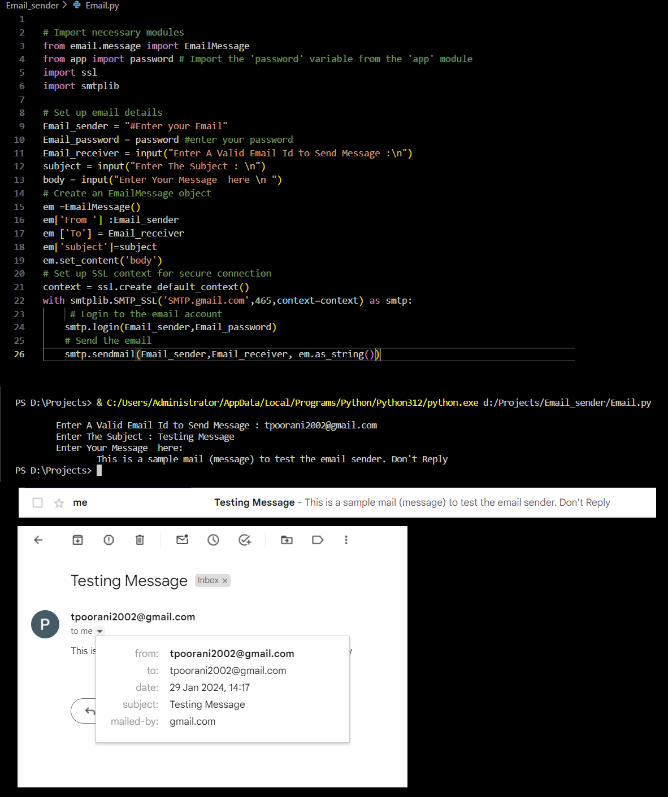

# Email Sender Python Script

This Python script allows you to send emails using the `smtplib` library. It's a simple yet powerful tool for sending emails programmatically.

## Introduction

This project is a part of my Python learning journey, focusing on practical applications. The Email Sender script enables you to send emails from a specified Gmail account to any valid email address.

## Features

- Sends emails securely using SMTP_SSL
- Easy-to-use interface for entering email details
- Customize the subject and body of the email

## How to Use

1. **Clone the Repository:**
    ```bash
   git clone https://github.com/Poorani-27/PYTHON_PROJECTS.git
   cd PYTHON_PROJECTS/email-sender
    ```

2. **Set Up Your Gmail Account:**
    - Make sure "Less secure app access" is turned on in your Gmail account settings.
    - Generate an "App Password" for your Gmail account and replace it in the `app.py` module.

3. **Run the Script:**
    ```bash
    python email_sender.py
    ```
    - Enter the recipient's email, subject, and message when prompted.

## Contributing

If you have ideas for improvement or find any issues, feel free to contribute! Follow the standard [contribution guidelines](CONTRIBUTING.md).

## Stay Consistent and Motivated

> "Your work is going to fill a large part of your life, and the only way to be truly satisfied is to do what you believe is great work. And the only way to do great work is to love what you do." - Steve Jobs

## outcomes 

