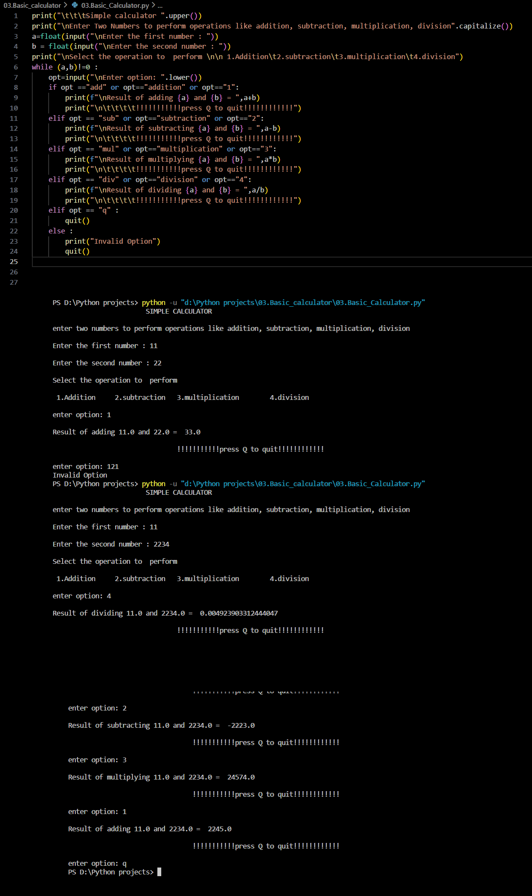

# Simple Calculator Python Script

A basic calculator script that performs addition, subtraction, multiplication, and division on two numbers.

## Introduction

This project is a simple calculator implemented in Python. It allows users to perform basic arithmetic operations on two numbers. It's designed for simplicity and ease of use.

## Features

- Addition
- Subtraction
- Multiplication
- Division

## How to Use

1. **Clone the Repository:**
    ```bash
    cd python-projects/simple-calculator
    git clone https://github.com/Poorani-27/PYTHON_PROJECTS.git

    ```

2. **Run the Script:**
    ```bash
    python calculator.py
    ```
    - Enter two numbers and select an operation from the menu.

3. **Operations Menu:**
    - Addition: Enter `add`, `addition`, or `1`.
    - Subtraction: Enter `sub`, `subtraction`, or `2`.
    - Multiplication: Enter `mul`, `multiplication`, or `3`.
    - Division: Enter `div`, `division`, or `4`.
    - To quit: Enter `q`.


## Stay Consistent and Motivated


> "It's not that I'm so smart, it's just that I stay with problems longer." - Albert Einstein

