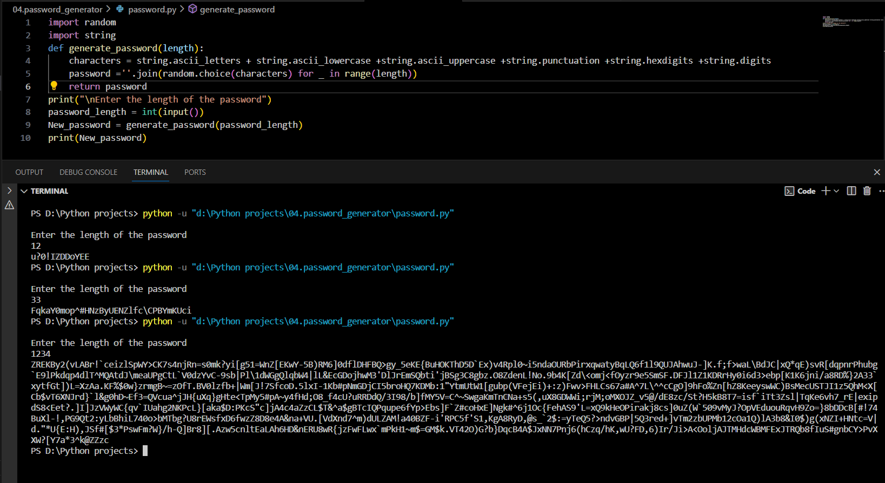

# Password Generator Python Script

A simple password generator script written in Python that creates strong and random passwords.

> "Success is not final, failure is not fatal: It is the courage to continue that counts." - Winston Churchill


## Introduction

This project is a password generator that creates secure passwords based on specified length and character sets. It's a useful tool for generating strong passwords for various applications.

## Features

- Generates random passwords
- Adjustable length for the generated passwords
- Utilizes a mix of uppercase letters, lowercase letters, digits, and special characters

## How to Use

1. **Clone the Repository:**
    ```bash
    git clone https://github.com/Poorani-27/PYTHON_PROJECTS.git
    cd python-projects/password-generator
    ```

2. **Run the Script:**
    ```bash
    python password_generator.py
    ```
    - Enter the desired length of the password when prompted.

3. **Generated Password:**
    - The script will output a randomly generated password.




