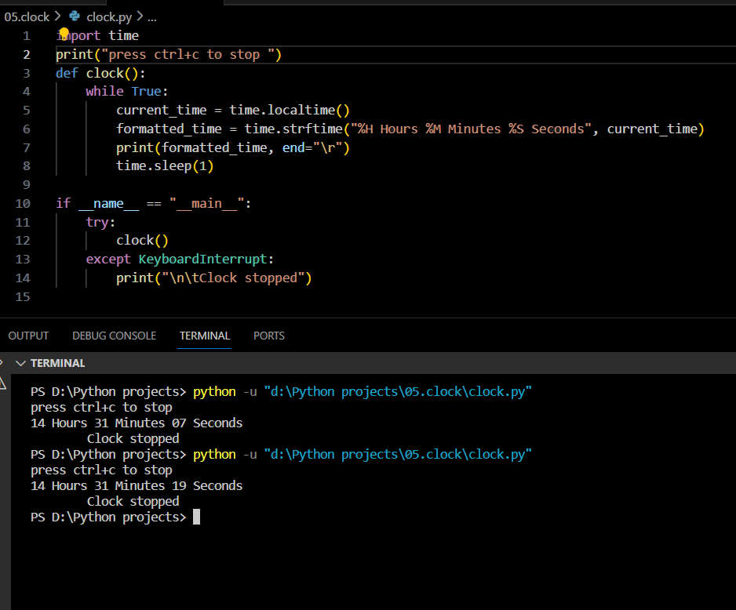
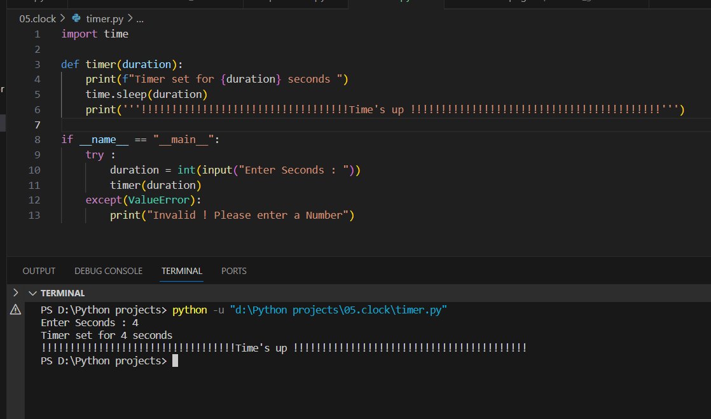

# Time Tools Python Scripts


A collection of Python scripts for time-related functionalities - a simple clock and a timer.


> "You will never find time for anything. If you want time, you must make it." - Charles Buxton

## Introduction

This project includes two scripts: one for displaying a real-time clock and another for setting a countdown timer. These tools can be handy for tracking time or setting reminders.

## Features

1. **Clock Script:**
    - Displays the current time in the console.
    - Press `Ctrl+C` to stop the clock.

2. **Timer Script:**
    - Sets a countdown timer for a specified duration.
    - Provides a notification when the time is up.

## How to Use

1. **Clone the Repository:**
    ```bash
    git clone https://github.com/Poorani-27/PYTHON_PROJECTS.git
    cd python-projects/time-tools
    ```

2. **Run the Clock Script:**
    ```bash
    python clock.py
    ```
    - Press `Ctrl+C` to stop the clock.

3. **Run the Timer Script:**
    ```bash
    python timer.py
    ```
    - Enter the desired duration in seconds when prompted.



