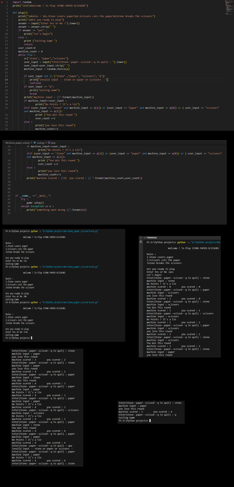

# Stone-Paper-Scissors Game Python Script

A simple command-line Stone-Paper-Scissors game written in Python.


> "Success is not the key to happiness. Happiness is the key to success. If you love what you are doing, you will be successful." - Albert Schweitzer

## Introduction

This project is a classic game of Stone-Paper-Scissors implemented in Python. It allows you to play against the computer and keeps track of your score.

## Features

- Player vs. Computer gameplay
- Randomly generated computer moves
- Simple and interactive interface

## How to Use

1. **Clone the Repository:**
    ```bash
    git clone https://github.com/Poorani-27/PYTHON_PROJECTS.git

    cd python-projects/stone-paper-scissors
    ```

2. **Run the Game:**
    ```bash
    python stone_paper_scissors.py
    ```
    - Follow the on-screen instructions to play.
    - Enter `q` to quit the game.





