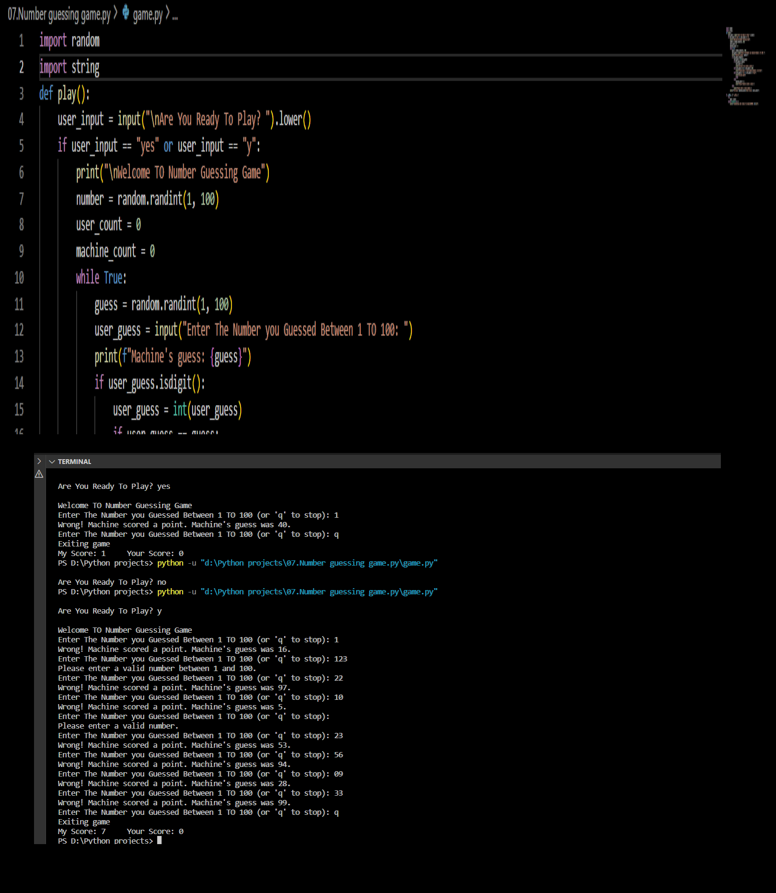

> "It's not whether you get knocked down, it's whether you get up." - Vince Lombardi


# Number Guessing Game Python Script

A simple Number Guessing Game implemented in Python where you compete against the machine.


## Introduction

This project is a classic Number Guessing Game. You'll be competing against the machine, trying to guess the correct number randomly chosen by the machine.

## How to Play

1. **Clone the Repository:**
    ```bash
    git clone https://github.com/Poorani-27/PYTHON_PROJECTS.git
    
    cd python-projects/number-guessing-game
    ```

2. **Run the Game:**
    ```bash
    python number_guessing_game.py
    ```
    - Enter the number you guessed between 1 and 100 when prompted.
    - Type 'q' to stop the game.

3. Scoring:
    - You earn a point if your guess matches the machine's guess.
    - The machine earns a point if your guess is incorrect.

4. Game Results:
    - The game will display the final scores - Your Score vs. Machine's Score.




