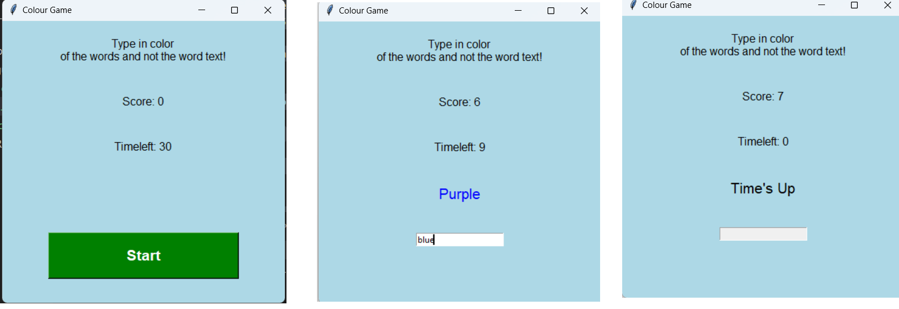

# Colour Game Project

This project is a simple color game implemented using Tkinter in Python. The game randomly displays color names, and the player must enter the color of the text, not the word itself.

## Features

- Start button to begin the game.
- Entry field to input color names.
- Score tracking and countdown timer.

## Instructions

- Run the `color_game.py` script.
- Type the color of the displayed word's text, not the word itself.
- Score points for each correct answer within the time limit.

